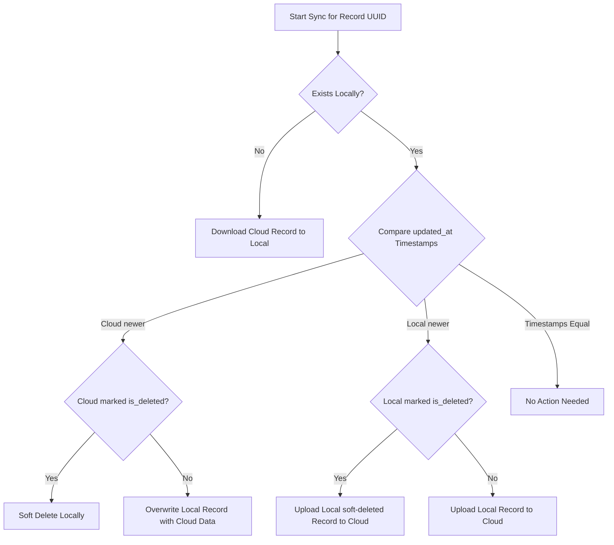

# Gonabhavi Accounting & Billing App — Technical Blueprint

This document contains the exact technical specification, database schema, module architecture, design system, and business logic formulas for the Gonabhavi application. If this file is provided to an AI coding assistant in the future, it contains all information necessary to reconstruct, maintain, or debug the codebase exactly as specified.

---

## 1. Project Tech Stack & Configuration

The application is built using a modern, lightweight, vanilla front-end stack that requires no complex compilation or heavy dependencies:
- **Core Engine**: Vanilla HTML5, CSS3, and modern JavaScript (ES Modules).
- **Build Tool**: Vite (configured in `vite.config.js` to build a production bundle in `dist/`).
- **Database System**: Local-first storage using the browser's `localStorage` for instant operations, with an optional cloud sync backed by **Supabase**.
- **Libraries**:
  - `Lucide Icons` (used via CDN or local assets for vector iconography).
  - `JsBarcode` (used in barcode label printing).
  - `Supabase Client Library` (loaded from CDN in `index.html` as `window.supabase` to avoid npm bundles).

---

## 2. Directory & Module Structure

The project code is organized into the following file hierarchy:

```text
h:/g3.5/
├── index.html                   # Main entry point (layout skeleton, sidebars, viewport, CDN links)
├── package.json                 # Dependency manifest (Vite dev dependencies)
├── vite.config.js               # Vite configurations (dev server port, public paths)
├── clear_data.sql               # Reset script for trial data (executed in Supabase SQL editor)
├── GONABHAVI_FEATURES_SPEC.txt # Complete plain-English functional feature specification
└── src/
    ├── app.js                   # Application controller, hash router, and layout handlers
    ├── db.js                    # Database operations, caching, and Supabase synchronization manager
    ├── style.css                # Global styles, variables, theme overrides, and mobile queries
    └── views/                   # Dynamic view modules (rendered into the app viewport)
        ├── dashboard.js         # Business overview stats cards, recent invoices, product search with ledger modal
        ├── billing.js           # Sales billing screen (inline quick-add, barcode scanning, list)
        ├── documents.js         # Document views: SaleOrderView, QuotationView, EstimateView, DeliveryChallanView
        ├── purchases.js         # PurchaseBillView for recording stock and supplier bills
        ├── payments.js          # Cash flows views: PaymentInView, PaymentOutView, ExpensesView
        ├── returns.js           # Ledger returns views: SalesReturnView, PurchaseReturnView
        ├── inventory.js         # Inventory list, stock history ledger, and StockAdjustmentView
        ├── transfers.js         # Physical Cash/UPI to Bank fund transfer view
        ├── reports.js           # Financial reports: P&L, Balance Sheet, GST, Ledgers, Audit Log
        ├── labels.js            # Barcode grid label print configuration page
        ├── settings.js          # Company profile settings, invoice sequences, and SyncBackupView
        ├── products.js          # Product management CRUD (create, read, update, delete)
        ├── customers.js         # Customer management CRUD and balance histories
        └── suppliers.js         # Supplier management CRUD and due histories
```

---

## 3. Database Schema & Storage Model

### Local-First Data Engine (`db.js`)
All tables are stored inside the browser's `localStorage` using keys prefixed with `gb_` (e.g., `gb_products`, `gb_invoices`). 
- Corrupted parsing of local storage must be caught safely inside a `try-catch` block, falling back to an empty array `[]` to prevent application crashes.
- Disk space limits (`QuotaExceededError`) must be trapped, prompting the user with a persistent warning asking them to trigger a Cloud Sync to clean local logs.

### Supabase Cloud Database Mapping
Supabase tables share a unified relational structure. Instead of mapping every JSON property to database columns, all attributes are saved inside a single `JSONB` column named `data`. This allows dynamic model modifications on the client-side without running database migrations:

| Field Name | Type | Description |
| :--- | :--- | :--- |
| `id` | `uuid` (Primary Key) | Standard UUID v4 generated by the local device client. |
| `user_id` | `uuid` (Foreign Key) | Supabase authenticated user ID linking the record to a specific account. |
| `created_at` | `timestamptz` | Date-time timestamp when the record was initially created. |
| `updated_at` | `timestamptz` | Date-time timestamp updated on every modification (used for sync sorting). |
| `is_deleted` | `boolean` | Flag for soft-deletion (default: `false`). Set to `true` on deletion. |
| `data` | `jsonb` | Complete raw JSON payload of the entity object (defined below). |

### Entity JSON Objects (Stored in the `data` Column)

Every entity must include its standard system attributes (`id`, `user_id`, `created_at`, `updated_at`, `is_deleted`) alongside the following specific object shapes:

#### 1. `products`
```json
{
  "name": "String (Required)",
  "qr": "String (Required, Unique barcode value)",
  "category": "String",
  "description": "String",
  "price": 0.00,       // Sale Price (MRP) — GST-inclusive
  "purchase_price": 0.00, // Stored last-known purchase rate — GST-exclusive
  "gst": 0,            // GST% rate (must be 0, 5, 12, 18, or 28)
  "discount": 0.00,    // Default discount % (0 to 100)
  "opening_stock": 0.00
}
```

#### 2. `customers`
```json
{
  "name": "String (Required)",
  "phone": "String (Optional, 10 digits validated)",
  "email": "String (Optional, email formatted)",
  "address": "String (Optional)",
  "gstin": "String (Optional, 15 alphanumeric characters)",
  "opening_balance": 0.00
}
```

#### 3. `suppliers`
```json
{
  "name": "String (Required)",
  "phone": "String (Optional, 10 digits validated)",
  "email": "String (Optional, email formatted)",
  "address": "String (Optional)",
  "gstin": "String (Optional, 15 alphanumeric characters)",
  "opening_balance": 0.00
}
```

#### 4. `invoices`
```json
{
  "invoice_number": "String (Required, unique)",
  "date": "YYYY-MM-DD (Required)",
  "customer_id": "String (UUID matching customer, null for Walk-in)",
  "customer_name": "String",
  "items": [
    {
      "product_id": "UUID (Required)",
      "product_name": "String",
      "qty": 1.00,
      "rate": 0.00,       // Unit sale price (MRP), GST-inclusive
      "discount_percent": 0.00,
      "gst_percent": 0
    }
  ],
  "grand_total": 0.00,    // Sum of line totals before overall discount
  "final_discount": 0.00, // Whole-invoice discount adjustment
  "cash_paid": 0.00,
  "upi_paid": 0.00,
  "bank_paid": 0.00,
  "balance_due": 0.00     // grand_total - final_discount - paid amounts
}
```

#### 5. `invoice_payments` (Links Receive Balance entries to invoice records)
```json
{
  "invoice_id": "UUID (Required)",
  "date": "YYYY-MM-DD",
  "amount": 0.00,
  "method": "cash | upi | bank",
  "note": "String"
}
```

#### 6. `sale_orders`
```json
{
  "order_number": "String (e.g. SO-0001)",
  "date": "YYYY-MM-DD",
  "customer_id": "UUID (Optional)",
  "customer_name": "String",
  "items": [
    {
      "product_id": "UUID",
      "product_name": "String",
      "qty": 0.00,
      "rate": 0.00,
      "discount_percent": 0.00,
      "gst_percent": 0
    }
  ],
  "cash_paid": 0.00,      // Advance payments
  "upi_paid": 0.00,
  "bank_paid": 0.00,
  "grand_total": 0.00,
  "status": "Pending | Converted"
}
```

#### 7. `purchases` (Purchase Bills)
```json
{
  "bill_number": "String (Required, unique)",
  "date": "YYYY-MM-DD",
  "supplier_id": "UUID (Required)",
  "supplier_name": "String",
  "items": [
    {
      "product_id": "UUID (Required)",
      "product_name": "String",
      "qty": 1.00,
      "purchase_rate": 0.00, // Unit purchase rate, GST-exclusive
      "gst_percent": 0
    }
  ],
  "grand_total": 0.00,       // Tax-inclusive bill aggregate
  "cash_paid": 0.00,
  "upi_paid": 0.00,
  "bank_paid": 0.00,
  "balance_due": 0.00
}
```

#### 8. `expenses`
```json
{
  "date": "YYYY-MM-DD",
  "category": "String (Required, e.g. Rent, Power, Salary)",
  "description": "String",
  "amount": 0.00,
  "method": "cash | upi | bank"
}
```

#### 9. `payment_ins` (Standalone payment collections from customer ledger)
```json
{
  "customer_id": "UUID (Required)",
  "customer_name": "String",
  "date": "YYYY-MM-DD",
  "amount": 0.00,
  "method": "cash | upi | bank",
  "invoice_id": "UUID (Optional, linked only if recorded against a specific invoice)",
  "note": "String"
}
```

#### 10. `payment_outs` (Payments to suppliers)
```json
{
  "supplier_id": "UUID (Required)",
  "supplier_name": "String",
  "date": "YYYY-MM-DD",
  "amount": 0.00,
  "method": "cash | upi | bank",
  "note": "String"
}
```

#### 11. `estimates`
```json
{
  "estimate_number": "String (e.g. EST-0001)",
  "date": "YYYY-MM-DD",
  "customer_id": "UUID (Optional)",
  "customer_name": "String",
  "items": [
    {
      "product_id": "UUID",
      "product_name": "String",
      "qty": 0.00,
      "rate": 0.00,
      "discount_percent": 0.00,
      "gst_percent": 0
    }
  ],
  "grand_total": 0.00
}
```

#### 12. `delivery_challans`
```json
{
  "challan_number": "String (e.g. DC-0001)",
  "date": "YYYY-MM-DD",
  "customer_id": "UUID (Optional)",
  "customer_name": "String",
  "items": [
    {
      "product_id": "UUID",
      "product_name": "String",
      "qty": 0.00
    }
  ]
}
```

#### 13. `sales_returns`
```json
{
  "return_number": "String (e.g. SR-0001)",
  "date": "YYYY-MM-DD",
  "invoice_id": "UUID (Required)",
  "invoice_number": "String",
  "customer_id": "UUID",
  "customer_name": "String",
  "items": [
    {
      "product_id": "UUID",
      "product_name": "String",
      "qty": 0.00,         // Returned qty (must be <= invoice sales qty)
      "rate": 0.00,        // Rates are inherited from original invoice line (MRP)
      "discount_percent": 0.00,
      "gst_percent": 0,
      "reason": "String"
    }
  ],
  "grand_total": 0.00
}
```

#### 14. `purchase_returns`
```json
{
  "return_number": "String (e.g. PR-0001)",
  "date": "YYYY-MM-DD",
  "purchase_id": "UUID (Required)",
  "bill_number": "String",
  "supplier_id": "UUID",
  "supplier_name": "String",
  "items": [
    {
      "product_id": "UUID",
      "product_name": "String",
      "qty": 0.00,
      "purchase_rate": 0.00, // Inherited from original bill line (GST-exclusive)
      "gst_percent": 0,
      "reason": "String"
    }
  ],
  "grand_total": 0.00
}
```

#### 15. `quotations`
```json
{
  "quotation_number": "String (e.g. QT-0001)",
  "date": "YYYY-MM-DD",
  "valid_until": "YYYY-MM-DD",
  "customer_id": "UUID (Optional)",
  "customer_name": "String",
  "items": [
    {
      "product_id": "UUID",
      "product_name": "String",
      "qty": 0.00,
      "rate": 0.00,
      "discount_percent": 0.00,
      "gst_percent": 0
    }
  ],
  "grand_total": 0.00
}
```

#### 16. `fund_transfers`
```json
{
  "date": "YYYY-MM-DD",
  "from_account": "cash | upi",
  "to_account": "bank",
  "amount": 0.00,
  "note": "String"
}
```

#### 17. `stock_adjustments`
```json
{
  "date": "YYYY-MM-DD",
  "product_id": "UUID (Required)",
  "product_name": "String",
  "qty_change": 0.00, // Positive for stock gains, negative for stock losses
  "reason": "String",  // Damaged | Expired | Count Correction
  "note": "String"
}
```

#### 18. `audit_logs`
```json
{
  "timestamp": "ISO Date-Time (Required)",
  "action": "String (e.g. Invoice Saved)",
  "details": "String"
}
```

#### 19. `business_settings` (Unique table storing singular settings block)
```json
{
  "company_name": "String (Required, default: My Business)",
  "phone": "String",
  "email": "String",
  "address": "String",
  "gstin": "String",
  "pan": "String",
  "state_name": "String",
  "state_code": "String (2-digit)",
  "bank_name": "String",
  "bank_account_number": "String",
  "ifsc_code": "String",
  "upi_id": "String",
  "invoice_terms": "String",
  "invoice_prefix": "String",
  "invoice_suffix": "String",
  "invoice_separator": "String",
  "invoice_start_number": 1,
  "invoice_padding": 4,
  "fy_reset": false,
  "template_style": "classic | modern | simple",
  "supabase_url": "String",
  "supabase_key": "String",
  "account_cash_label": "Cash",
  "account_upi_label": "UPI",
  "account_bank_label": "Bank",
  "staff_users": [
    {
      "email": "String",
      "permissions": {
        "allow_purchases": false,
        "allow_expenses": false,
        "allow_reports": false,
        "allow_dashboard_balances": false,
        "allow_delete_invoices": false
      }
    }
  ]
}
```

---

## 4. Design System & CSS Variables (`style.css`)

The layout features a premium Glassmorphic look with two color configuration modes (Light and Dark) that are read by script configurations setting `data-theme` on the `<html>` root element.

### HSL Theme Color Palettes

```css
:root[data-theme="light"] {
  --bg-app: hsl(210, 30%, 96%);
  --bg-sidebar: hsla(215, 30%, 15%, 0.03);
  --bg-card: rgba(255, 255, 255, 0.7);
  --bg-header: rgba(255, 255, 255, 0.8);
  --border-color: rgba(218, 224, 233, 0.8);
  --text-main: hsl(220, 15%, 15%);
  --text-secondary: hsl(220, 10%, 45%);
  
  --primary-brand: hsl(150, 60%, 35%); /* Soft Emerald/Sage Green */
  --primary-hover: hsl(150, 60%, 28%);
  --color-danger: hsl(0, 75%, 45%);
  --color-warning: hsl(35, 90%, 40%);
  --color-info: hsl(210, 85%, 45%);
}

:root[data-theme="dark"] {
  --bg-app: hsl(220, 20%, 8%);
  --bg-sidebar: hsla(220, 20%, 4%, 0.4);
  --bg-card: rgba(24, 28, 36, 0.45);
  --bg-header: rgba(15, 18, 25, 0.6);
  --border-color: rgba(255, 255, 255, 0.05);
  --text-main: hsl(210, 17%, 88%);
  --text-secondary: hsl(215, 12%, 58%);
  
  --primary-brand: hsl(150, 50%, 45%); /* Glowing Mint Green */
  --primary-hover: hsl(150, 55%, 52%);
  --color-danger: hsl(0, 80%, 60%);
  --color-warning: hsl(38, 95%, 55%);
  --color-info: hsl(205, 90%, 55%);
}
```

---

## 5. Mobile UI Layout System (Vyapar Responsive Layout)

On smaller viewports, the desktop layout (which features a 280px left sidebar and wide horizontal tables) is overridden to match mobile ergonomics similar to the **Vyapar** accounting app.

### Core CSS Media Queries

Inside `style.css`, styles targeting widths **under 768px** (`@media (max-width: 768px)`) apply the following layout alterations:
1. **Sidebar Collapsed & Hidden**: Sidebar is hidden off-screen (`transform: translateX(-100%)`). A backdrop/overlay covers the viewport when open.
2. **Bottom Navigation Bar**: A standard persistent bottom navigation bar is added containing shortcuts to Dashboard (`#dashboard`), Invoices (`#invoices`), Inventory (`#inventory`), and Settings (`#settings`). Active items are styled with a colored indicator line.
3. **Floating Action Button (FAB)**: A green FAB containing a large `+` icon is placed at the bottom right (`bottom: 84px`, `right: 20px`), floating above the navigation bar. Clicking this navigates directly to New Invoice billing (`#billing`). The FAB is programmatically faded out when the viewport is active on the `#billing` view itself.
4. **Slide-Up Bottom Sheets**: Modals and dialog boxes do not display as center screen boxes. Instead, they translate from the bottom of the screen (`bottom: 0`, `left: 0`, `width: 100%`, border-radius top-left/top-right: `16px`), mimicking native mobile bottom sheets.
5. **Horizontal Table Scroll**: Table wrapper grids use `overflow-x: auto` with `-webkit-overflow-scrolling: touch` for fluid sliding, and cells use compact paddings.
6. **Form Inputs Auto-Zoom Prevention**: Text inputs and dropdown selections enforce `font-size: 16px` on screens below 768px (this stops Safari and Chrome browsers on iOS/Android from forcing auto-zoom on field focus).
7. **Mobile-First Invoicing Screen Layout Redesign**:
   - **Compact Header Grid** (`.billing-header-grid`): The Invoice Number and Invoice Date display side-by-side (50% width each) on a single row, and the Customer Selection dropdown spans the full width below them, reducing vertical space.
   - **Compact Search Grid** (`.billing-product-bar-grid`): Search Product input spans full width on row 1, and Barcode/QR input, Qty, and Add Button align side-by-side in a compact 3-column row below it.
   - **Mobile Cards List** (`.mobile-items-list-container`): Hides the desktop table on screens $\le 768\text{px}$ and renders each added product line as a clean, rounded `.mobile-item-card`. Includes a **Qty Stepper** with `-` and `+` buttons for quick touch adjustments without invoking the virtual keyboard.
   - **Sticky Footer Action Bar** (`.mobile-billing-footer`): Displays a sticky bottom bar above the bottom navigation showing "Net Payable: ₹X.XX" and a primary button "Pay / Save".
   - **Collapsible Checkout Drawer** (`.billing-checkout-sidebar`): Clicking the sticky footer triggers the Totals & Split Payments card to slide up from the bottom as a drawer modal (using `.show` transition class), with an overlay background (`.billing-checkout-overlay`) and close buttons.
   
---

## 6. Calculations, Logic, and Formulas

All mathematical operations are calculated dynamically to avoid data drift.

### 1. Sale Invoice Totals (GST-Inclusive Entry)
For sales billing (`billing.js`), line inputs entered by the user (MRP / Rate) already include GST. The math breaks down as follows for each item line:

$$\text{Gross Total} = \text{Quantity} \times \text{Rate (Sale Price / MRP)}$$

$$\text{Line Discount Amount} = \text{Gross Total} \times \left(\frac{\text{Discount \%}}{100}\right)$$

$$\text{Line Amount After Discount} = \text{Gross Total} - \text{Line Discount Amount}$$

$$\text{Line Taxable Amount} = \frac{\text{Line Amount After Discount}}{1 + \left(\frac{\text{GST \%}}{100}\right)}$$

$$\text{Line GST Amount} = \text{Line Amount After Discount} - \text{Line Taxable Amount}$$

$$\text{Final Line Total} = \text{Line Amount After Discount}$$

**Invoice Level Calculations**:
- $\text{Invoice Subtotal} = \sum \text{Line Taxable Amounts}$
- $\text{Total GST Collected} = \sum \text{Line GST Amounts}$
- $\text{Total Invoice Discount} = \sum \text{Line Discount Amounts}$
- $\text{Invoice Grand Total} = \sum \text{Final Line Totals}$
- $\text{Grand Total After Whole-Invoice Discount} = \text{Invoice Grand Total} - \text{Final Whole-Invoice Discount}$
- $\text{Balance Due} = \text{Grand Total After Whole-Invoice Discount} - \left(\text{Cash Paid} + \text{UPI Paid} + \text{Bank Paid}\right)$

---

### 2. Purchase Bill Totals (GST-Exclusive Entry)
For purchase bills (`purchases.js`), rates entered from supplier bills (Purchase Rates) are GST-exclusive. GST is calculated and added on top of the rate:

$$\text{Line Gross Total} = \text{Quantity} \times \text{Purchase Rate}$$

$$\text{Line Taxable Amount} = \text{Line Gross Total}$$

$$\text{Line GST Amount} = \text{Line Taxable Amount} \times \left(\frac{\text{GST \%}}{100}\right)$$

$$\text{Final Line Total} = \text{Line Taxable Amount} + \text{Line GST Amount}$$

**Purchase Level Calculations**:
- $\text{Purchase Grand Total} = \sum \text{Final Line Totals}$
- $\text{Balance Due} = \text{Purchase Grand Total} - \left(\text{Cash Paid} + \text{UPI Paid} + \text{Bank Paid}\right)$

---

### 3. Live Stock Calculation (With Cache System)
Stock levels are calculated live by checking transaction logs, preventing database sync drift.

To avoid performance bottlenecks on billing page load, a global stock cache dictionary (`_stockCache`) holds calculated values. This cache is cleared/invalidated automatically whenever a transaction affecting stock is saved, edited, or deleted (`invoices`, `purchases`, `sales_returns`, `purchase_returns`, `stock_adjustments`, `products`):

$$\begin{aligned}
\text{Current Product Stock} = &\ \text{Opening Stock} \\
&+ \sum \text{Purchased Qty (purchases)} \\
&- \sum \text{Sold Qty (invoices)} \\
&+ \sum \text{Sales Return Qty (sales\_returns)} \\
&- \sum \text{Purchase Return Qty (purchase\_returns)} \\
&+ \sum \text{Stock Adjustment Qty Change (stock\_adjustments)}
\end{aligned}$$

- **Negative Stock Safe Mode**: If the computed stock results in a value $< 0$, the displayed stock is shown as `0` to prevent UI corruption, and the item is flagged as a "Stock Error" for user verification.
- **Adjusting Current Stock**: When a user updates the "Current Stock" count of a product directly on the inventory screen, the system adjusts the product's static `opening_stock` value behind the scenes using this formula:

$$\begin{aligned}
\text{New Opening Stock} = &\ \text{Desired Current Stock} \\
&- \sum \text{Purchased Qty} \\
&+ \sum \text{Sold Qty} \\
&- \sum \text{Sales Return Qty} \\
&+ \sum \text{Purchase Return Qty} \\
&- \sum \text{Stock Adjustment Qty Change}
\end{aligned}$$

---

### 4. Customer Outstanding Balance Calculation
$$\begin{aligned}
\text{Customer Balance} = &\ \text{Opening Balance} \\
&+ \sum \text{Invoice Grand Totals after Final Discount} \\
&- \sum \text{Sales Return Grand Totals} \\
&- \sum \text{Payment-In Amounts (standalone and invoice payments)}
\end{aligned}$$

- Credit balances are supported and returned as negative values (e.g. customer overpaid or has advance credit).

---

### 5. Supplier Outstanding Balance Calculation
$$\begin{aligned}
\text{Supplier Balance} = &\ \text{Opening Balance} \\
&+ \sum \text{Purchase Bill Grand Totals} \\
&- \sum \sum \text{Payments on Purchase Bills (Cash + UPI + Bank paid fields)} \\
&- \sum \text{Purchase Return Grand Totals} \\
&- \sum \text{Payment-Out Amounts (standalone payments)}
\end{aligned}$$

---

### 6. Cash, UPI, and Bank Ledger Balances
The system maintains distinct ledger balances for Cash, UPI, and Bank accounts. The formulas for these are:

$$\begin{aligned}
\text{Cash Balance} = &\ \sum \text{Payment-In Cash} \\
&- \sum \text{Cash Expenses} \\
&- \sum \text{Payment-Out Cash} \\
&- \sum \text{Cash } \to \text{ Bank Transfers} \\
&+ \sum \text{Sale Order Cash Advances (unconverted orders)}
\end{aligned}$$

$$\begin{aligned}
\text{UPI Balance} = &\ \sum \text{Payment-In UPI} \\
&- \sum \text{UPI Expenses} \\
&- \sum \text{Payment-Out UPI} \\
&- \sum \text{UPI } \to \text{ Bank Transfers} \\
&+ \sum \text{Sale Order UPI Advances (unconverted orders)}
\end{aligned}$$

$$\begin{aligned}
\text{Bank Balance} = &\ \sum \text{Payment-In Bank} \\
&- \sum \text{Bank Expenses} \\
&- \sum \text{Payment-Out Bank} \\
&+ \sum \text{Cash } \to \text{ Bank Transfers} \\
&+ \sum \text{UPI } \to \text{ Bank Transfers} \\
&+ \sum \text{Sale Order Bank Advances (unconverted orders)}
\end{aligned}$$

- **Double-Counting Prevention (Billing & Orders)**: When a Sale Order with an advance payment is converted into a Sale Invoice, payments are recorded inside the invoice ledger. The balance engine only sums advance payments for active, *unconverted* orders (`status != 'Converted'`) to prevent double-counting.

---

## 7. Advanced Interface Interactions

### 1. Invoice Quick-Add Items
Inside `billing.js`, when search fails to match an existing product, the input acts as an inline quick-add form. A dropdown button `"+ Add [Search Term]"` appears:
- Clicking the button expands a small inline form displaying fields: Name, Barcode/QR, MRP (Sale Price), GST%, Discount%, and Initial Qty.
- Submitting the form writes a new record into `products`, calculates its adjusted `opening_stock` using the stock adjustment formula, caches it, and appends the product to the active invoice line. The billing view does not close or reload.

### 2. USB Barcode Scanner Auto-Add Engine
The app registers global keypress listeners on the billing search field to detect physical USB scanner outputs:
- A USB barcode scanner simulates rapid typing of characters followed by an `Enter` keystroke.
- **Auto-Detection Logic**: The app calculates the average delay between key presses. If characters are entered at a speed of **less than 50 milliseconds per character**, the system flags the input as a barcode scanner reading.
- Upon receiving the automated `Enter` key (or after typing ceases if the scanner does not send an enter key), the product containing the matching QR code is fetched and appended to the invoice list with a quantity of `1` immediately, without requiring manual button clicks.

### 3. Unique QR Check and Empty-String Duplicate Bypass
- Both `db.insert()` and `db.update()` check for duplicate QR codes. If a product contains a barcode that already exists on a different active product, the save fails and throws a user-facing validation error.
- **Empty-String Exemption**: Products saved without a QR/barcode contain empty strings (`qr: ""`). To allow multiple products without QR values, the database manager bypasses the uniqueness validation check if `newRecord.qr === ""`, preventing duplicate errors for empty QR fields.

### 4. Delete Safety Checks
To preserve ledger integrity, physical deletion is replaced with soft-deletion (`is_deleted: true`), and the following check rules are executed:
- **Product deletion**: Prevented if the product ID exists in any active invoice, purchase bill, sale order, or stock adjustment.
- **Customer deletion**: Prevented if the customer ID exists in any active invoice, sale order, payment-in record, or has a non-zero opening balance.
- **Supplier deletion**: Prevented if the supplier ID is referenced in any active purchase bill, payment-out record, or has a non-zero opening balance.
- **Invoice deletion**: Prevented if the invoice has payments recorded against it. The user must first edit the invoice to zero out paid fields before deletion is permitted.

---

## 8. Smart Synchronization Logic (Supabase)

Dynamic synchronization is triggered every time a database operation runs, and on app startup.

### 1. Debounced Auto-Sync
When a local write (insert, update, delete) occurs:
- The updated record is pushed to a local storage queue called `gb_sync_queue`.
- The synchronization process is debounced by **3 seconds**. If additional edits occur within 3 seconds, the sync is delayed, batching operations.
- The app dispatches a custom event (`gb-sync-status`) containing the payload `'syncing'`.
- The queue processor executes an `upsert` API call to the Supabase client.
- Successful uploads are popped from the queue. If a network failure occurs, records remain in the queue to retry during the next connection cycle, and sync status changes to `'local'`.

### 2. Full Synchronization Merging (7-Case Sync Algorithm)
During app initialization or manual sync, the system downloads all cloud changes and runs a comparative merge record-by-record:



#### Multi-Device Invoice Sequence Uniqueness:
If two devices generate the same invoice number (e.g. `INV-0045`) offline, the sync engine checks invoice numbers upon reconnecting.
- The older record (based on `created_at`) keeps the number.
- The newer record is updated to append `-DUP` to its invoice number (e.g. `INV-0045-DUP`).
- The user is alerted via toast to manually review and change the duplicate invoice number.
